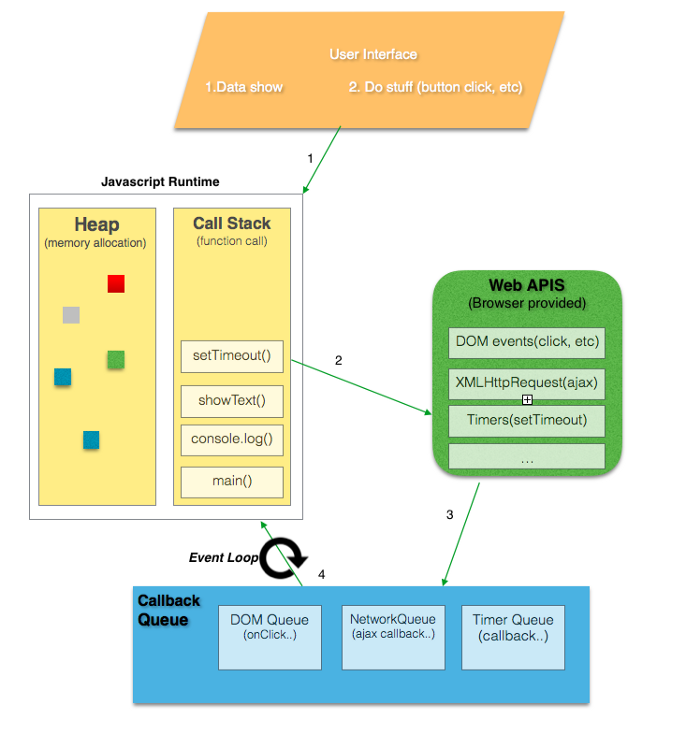

### 프로그램 덩이

js 프로그램은 .js 파일 하나로도 작성이 가능하지만, 보통은 여러 개의 덩이(chunk), 곧 지금 실행 중인 프로그램 덩이 하나 + 나중에 실행할 프로그램 덩이들로 구성된다. 가장 일반적인 프로그램 덩이 단위는 **함수(Function)**다. 

### 브라우저 환경의 구조



- 자바스크립트 엔진
    - Heap : 객체들은 힙 메모리에 할당된다. 크기가 동적으로 변하는 값들의 참조값을 가지고 있다.
    - Call stack : 함수가 호출될 시, 실행 컨텍스트가 생성되는데 이러한 실행 컨텍스트들이 콜 스택을 구성한다.
- Web API
    - 웹 브라우저에 구현된 API이다.
    - DOM event, AJAX, Timer 등이 있다.
- 이벤트 루프
    - 콜스택이 비어있다면, 태스크 큐에 있는 콜백 함수를 처리한다.
- 태스크 큐
    - 이벤트 루프는 하나 이상의 태스크 큐를 갖는다.
    - 태스크 큐는 태스크의 Set이다.
    - 이벤트 루프가 큐의 첫 번째 태스크를 가져오는 것이 아니라, 태스크 큐에서 실행 가능한 첫 번째 태스크를 가져오는 것이다. 태스크 중에서 가장 오래된 태스크를 가져온다.

### 이벤트 루프

JavaScript의 런타임 모델은 코드의 실행, 이벤트의 수집과 처리, 큐에 대기 중인 하위 작업을 처리하는 이벤트 루프에 기반하고 있으며, C 또는 Java 등 다른 언어가 가진 모델과는 상당히 다르다. 

이벤트 루프는 태스크가 들어오길 기다렸다가 태스크가 들어오면 이를 처리하고, 처리할 태스크가 없는 경우엔 잠드는, 끊임없이 돌아가는 자바스크립트 내의 루프이다. 

자바스크립트의 엔진이 돌아가는 알고리즘을 일반화 하면 다음과 같다.

1. 처리해야 할 태스크가 있는 경우
    - 먼저 들어온 태스크부터 순차적으로 처리함.
2. 처리해야할 태스크가 없는 경우 
    - 잠들어 있다가 새로운 태스크가 추가되면 다시 1로 돌아감

이 알고리즘은 우리가 브라우저를 사용해 인터넷을 서핑할 때 돌아가는 알고리즘이다. 이렇게 자바스크립트 엔진은 대부분의 시간동안 아무 일도 하지 않고 쉬고 있다가, 스크립트나 핸들러, 이벤트가 활성화될 때만 작동한다. 

자바스크립트 엔진을 활성화하는 태스크는 다음과 같은 것들이 있다. 

- 외부 스크립트 `<script src=”…”/>`가 로드될 때, 이 스크립트를 실행하는 것
- 사용자가 마우스를 움직일 때 `mousemove` 이벤트와 이벤트 핸들러를 실행하는 것
- `setTimeout` 에서 설정한 시간이 다 된 경우, 콜백 함수를 실행하는 것
- 기타 등등

태스크는 하나의 집합을 이룬다, 자바스크립트 엔진은 집합을 이루고 잇는 태스크들을 차례대로 처리하고, 새로운 태스크가 추가될 때까지 기다린다. 태스크를 기다리는 동안에 CPU 자원 소비는 0에 가까워지고 엔진은 잠들게 된다. 새로운 태스크는 엔진이 바쁠 때 추가될 수도 있다. 이때 이 태스크는 큐에 추가되는데 이렇게 태스크가 추가되는 큐는 V8 용어로 ‘**매크로태스크 큐(macrotask queue)**’ ****라고 한다. 

- 이벤트 루프는 왜 필요할까?
    
    자바스크립트는 싱글 스레드 기반의 언어이지만, 자바스크립트가 구동되는 환경은 여러 스레드가 사용된다. 여러 스레드가 사용되는 구동 환경이 자바스크립트 엔진과 연동하기 위해 사용하는 장치가 `이벤트 루프`이다.
    
    웹 사이트나 애플리케이션의 코드는 메인 스레드에서 실행되며, 같은 이벤트 루프를 공유한다. 
    
    - 메인 스레드의 역할
        
        사이트의 `코드를 실행`하고, `이벤트들을 받고 실행`하거나 `웹 컨텐츠를 렌더링하거나 페인팅` 하는 일들을 한다.
        
- 이벤트 루프의 종류
    - window event loop
        - 같은 origin인 모든 윈도우는 윈도우 이벤트 루프를 공유한다.
        - 모든 윈도우들은 동기적으로 소통할 수 있게 된다.
    - worker event loop
        - window event loop와는 독립적으로 실행된다.
    - worklet event loop
- 마이크로 태스크 큐 와 매크로 태스크 큐
    
    
    
    - 마이크로 태스크와 매크로 태스크 차이
        
        마이크로 태스크들은 실행하면서 새로운 마이크로 태스크를 큐에 추가할 수 있다. 이때 새롭게 추가된 마이크로 태스크도 큐가 빌 때까지 계속해서 실행된다.
        
        반면에 매크로 태스크는 이벤트 루프가 실행될 때 큐에 담겨 있는 매크로 태스크들만 실행시킨다. 즉 이벤트 루프 실행으로 인해 새롭게 추가된 매크로 태스크들은 다음 이벤트 루프 실행 시점까지 실행되지 않는다. 
        
    - 둘은 어떻게 구분되는가?
        
        태스크 큐는 구체적으로 마이크로 태스크 큐와 매크로 태스크 큐로 나누어지는데 API에 따라 마이크로 태스크 큐를 사용할지, 매크로 태스크 큐를 사용할지 결정된다. 
        
        > **macrotasks** : requestAnimationFrame, I/O, UI rendering, setTimeout, setInterval, setImmediate
        > 
        > 
        > **microtasks** : process.nextTick, Promises, queueMicrotask(f), MutationObserver
        > 
- 이벤트 루프의 실행
    
    이벤트 루프는 다음의 동작을 반복한다.
    
    1. 매크로 태스크 큐에서 가장 오래된 실행 가능한 태스크를 꺼내서 실행한다.
    2. 마이크로 태스크 큐에 있는 모든 태스크를 실행한다.
    3. 렌더링 작업을 실행한다.
    4. 매크로 태스크 큐에 새로운 매크로 태스크가 나타날 때까지 대기한다.
    5. 1번으로 돌아간다.
    
    ```jsx
    console.log('script start'); // A
    
    setTimeout(function () { // B
      console.log('setTimeout');
    }, 0);
    
    Promise.resolve() 
      .then(function () { // C
        console.log('promise1');
      })
      .then(function () { // D
        console.log('promise2');
      });
    
    console.log('script end'); // E
    
    // 실행 결과
    // script start
    // script end
    // promise1
    // promise2
    // setTimeout
    ```
    
    - 해당 코드의 단계별 실행과정은 [여기](https://jakearchibald.com/2015/tasks-microtasks-queues-and-schedules/)서 확인 가능하다.
    1. 콜스택에 해당 스크립트의 실행 컨텍스트가 생성된다.
    2. 매크로 태스크에 스크립트 로딩에 대한 매크로 태스크가 실행된다.
    3. 이벤트 루프의 동작으로 매크로 태스크 큐에 들어있는 태스크 실행
    4. script start 출력
    5. setTimeout에 대한 매크로 태스크가 생성된다.
    6. Promise.Resolve.then에 대한 마이크로 태스크가 생성
    7. script end 출력
    8. 콜스택 pop
    9. 매크로 태스크 실행이 완료되었으므로 마이크로 태스크 실행
    10. 마이크로 태스크에 들어있는 첫 Promise.then의 콜백 실행
    11. promise1 출력
    12. 해당 동작에 대한 .then이 마이크로 태스크로 생성
    13. 해당 콜백 실행
    14. promise2 출력
    15. 마이크로 태스크가 완료되었고, 매크로 태스크 큐에 태스크가 남아있기 때문에 해당 setTimeout 실행
    16. setTimeout 콜백 실행
    17. setTimeout 출력

### Callback 함수

- 비동기 처리란?
    
    자바스크립트의 비동기 처리란, 특정 코드의 연산이 끝날 때까지 코드의 실행을 멈추지 않고 다음 코드를 먼저 실행하는 자바스크립트의 특성을 의미한다.
    
    - 비동기 처리의 사례들
        1. ajax
            
            ```jsx
            function getData() {
            	var tableData;
            	$.get('https://domain.com/products/1', function(response) {
            		tableData = response;
            	});
            	return tableData;
            }
            
            console.log(getData()); // undefined
            ```
            
            해당 코드의 실행 결과는 undefined이다. 통신을 통해 받아온 tableData라는 변수값이 출력될줄 알았는데 전혀 다른 결과가 나왔다. 그 이유는 `$.get()`으로 데이터를 요청하고 받아올 때까지 기다리지 않고 다음 코드인 `return tableData;` 를 실행했기 때문이다. 이와 같이 **특정 로직의 실행이 끝날 때까지 기다리지 않고 나머지 코드를 먼저 실행하는 것을 비동기 처리**라고한다. 
            
        2. setTimeout
            
            ```jsx
            console.log('Hello');
            setTimeout(function() {
            	console.log('Bye');
            }, 3000);
            console.log('Hello Again');
            ```
            
            setTimeout은 WebAPI의 한 종류이다. 
            
            해당 코드는 
            
            - Hello 출력
            - Hello Again 출력
            - 3초 있다가 Bye 출력
            
            처럼 실행되는데, setTimeout이 비동기 방식으로 실행되기 때문에 setTimeout을 일단 실행하고 나서 바로 다음 코드인 `console.log(’Hello Again’);`으로 넘어갔기 때문이다
            
    - 비동기 문제 해결하기
        - callback함수
            
            콜백함수를 사용하는 이유는 인자에 따른 여러가지 실행 결과를 표현하기 위해서 사용한다.  
            
            ```jsx
            function getData(callbackFunc) {
            	var tableData;
            	$.get('https://domain.com/products/1', function(response) {
            		callbackFunc(response);
            	});
            }
            
            getData(function(tableData){
            	console.log(tableData);
            });
            ```
            
            - callback의 문제점
                
                callback 지옥이 문제가 될 수 있다. 비동기 처리 로직을 해결하기 위해 callback 함수를 연속해서 사용할 때 발생하는 문제이다. 이러한 코드 구조는 가독성도 떨어지고, 로직을 변경하기도 어렵기 때문에 좋지 않다.
                
        - Promise
            
            Promise는 자바스크립트 비동기 처리에 사용되는 객체이다. 
            
            - Promise의 세가지 상태
                - Pending(대기) - 비동기 처리 로직이 아직 완료되지 않은 상태, 초기 상태
                    
                    ```jsx
                    new Promise();
                    
                    new Promise(function(resolve, reject){
                    	// ...
                    });
                    ```
                    
                    위와 같이 메서드를 호출하면 Pending 상태가 된다.
                    
                    `new Promise()` 메서드를 호출할 때 callback 함수를 선언할 수 있고, callback 함수의 인자는 resolve, rejected이다. 
                    
                - Fulfilled(이행) - 비동기 처리가 완료되어 프로미스가 결과 값을 반환해준 상태
                    
                    ```jsx
                    new Promise(function(resolve, reject){
                    	resolve();
                    });
                    ```
                    
                    여기서 resolve를 위와 같이 실행하면 fulfilled 상태가 된다. 그리고 이 상태에 진입했을 때, `then()`을 이용하여 처리 결과 값을 받을 수 있다.
                    
                    ```jsx
                    function getData() {
                      return new Promise(function(resolve, reject) {
                        var data = 100;
                        resolve(data);
                      });
                    }
                    
                    getData().then(function(resolvedData) {
                      console.log(resolvedData); // 100
                    });
                    ```
                    
                - Rejected(실패) - 비동기 처리가 실패하거나 오류가 발생한 상태
                    
                    ```jsx
                    new Promise(function(resolve, reject){
                    	reject();
                    });
                    ```
                    
                    resolve 대신 reject를 호출하면 실패한 상태가 된다. 그리고 이 실패 상태에 대한 결과값을 `catch()` 로 받을 수 있다.
                    
                    ```jsx
                    function getData() {
                      return new Promise(function(resolve, reject) {
                        reject(new Error("Request is failed"));
                      });
                    }
                    
                    // reject()의 결과 값 Error를 err에 받음
                    getData().then().catch(function(err) {
                      console.log(err); // Error: Request is failed
                    });
                    ```
                    
        - async/await
            
            기존의 비동기 처리 방식의 단점을 보완하고 개발자가 읽기 좋은 코드를 작성할 수 있게 도와준다. 여기서 읽기 좋은 코드란 위에서부터 아래로 한 줄 한 줄 읽으면서 사고할 수 있는 코드를 의미한다. 
            
            ```jsx
            async function logName() {
              var user = await fetchUser('domain.com/users/1');
              if (user.id === 1) {
                console.log(user.name);
              }
            }
            ```
            
            ```jsx
            function logName() {
              // 아래의 user 변수는 위의 코드와 비교하기 위해 일부러 남겨놓았습니다.
              var user = fetchUser('domain.com/users/1', function(user) {
                if (user.id === 1) {
                  console.log(user.name);
                }
              });
            }
            ```
            
            위의 코드는 async/await을 적용한 코드이고, 아래는 아니다. 위의 코드가 아래의 코드보다 읽기 쉬워보인다. 
            
            - async/await 사용 방법
                
                ```jsx
                async function 함수명() {
                  await 비동기_처리_메서드_명();
                }
                ```
                
                함수 앞에 async 라는 예약어를 붙이고, 비동기 처리를 할 메소드 앞에 await을 붙이면 된다. 이때 await은 Promise 객체를 반환하는 함수에 붙여야 함수가 의도한대로 동작한다. 
                
                ```jsx
                function sumNumber(i){
                  let num = 0;
                  for(let j = 0; j < i; j+=1){
                    num += j;
                  }
                  return new Promise((resolve, reject) =>{
                    if(num){
                      resolve(num);
                    }else{
                      reject(new Error('NAN'));
                    }
                  })
                }
                
                async function showNumber(i){
                  await sumNumber(i).then((result) =>{
                    console.log(result);
                  }) 
                }
                console.log('wow');
                showNumber(1000000000);
                console.log('hello');
                ```
                
                이 위에 코드는 자체 작성한 코드인데, 실행 시점이 이해가 안감. `wow`와 `hello`가 거의 순차적으로 바로 찍힌 이후에 `showNumber()` 결과가 출력될 줄 알았으나 그렇게 실행이 안되고 `hello`와 `showNumber()`결과가 같이 찍힌다. 
                

[자바스크립트 비동기 처리와 콜백 함수](https://joshua1988.github.io/web-development/javascript/javascript-asynchronous-operation/)

[자바스크립트 Promise 쉽게 이해하기](https://joshua1988.github.io/web-development/javascript/promise-for-beginners/)

[자바스크립트 async와 await](https://joshua1988.github.io/web-development/javascript/js-async-await/)

[Promise - JavaScript | MDN](https://developer.mozilla.org/ko/docs/Web/JavaScript/Reference/Global_Objects/Promise)

[자바스크립트와 이벤트 루프 : NHN Cloud Meetup](https://meetup.toast.com/posts/89)

[이벤트 루프와 태스크 큐 (마이크로 태스크, 매크로 태스크)](https://velog.io/@yejineee/%EC%9D%B4%EB%B2%A4%ED%8A%B8-%EB%A3%A8%ED%94%84%EC%99%80-%ED%83%9C%EC%8A%A4%ED%81%AC-%ED%81%90-%EB%A7%88%EC%9D%B4%ED%81%AC%EB%A1%9C-%ED%83%9C%EC%8A%A4%ED%81%AC-%EB%A7%A4%ED%81%AC%EB%A1%9C-%ED%83%9C%EC%8A%A4%ED%81%AC-g6f0joxx)

[이벤트 루프와 매크로태스크, 마이크로태스크](https://ko.javascript.info/event-loop)

[자바스크립트 - 동기(Synchronous)? 비동기(asynchronous)?](https://ljtaek2.tistory.com/142)

[자바스크립트 - 동작 원리](https://ljtaek2.tistory.com/129?category=897337)

[비동기 프로그래밍 | JavaScript로 만나는 세상](https://helloworldjavascript.net/pages/285-async.html)