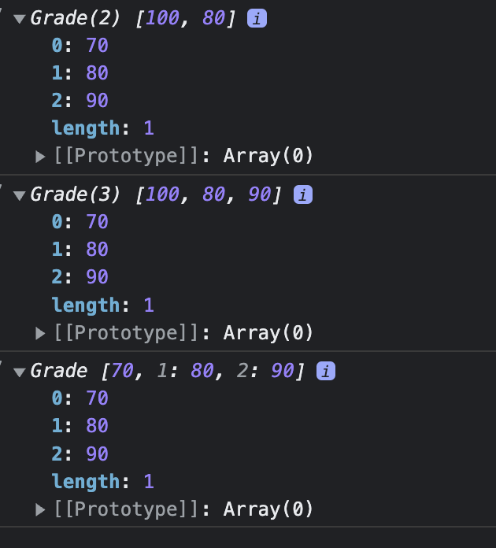
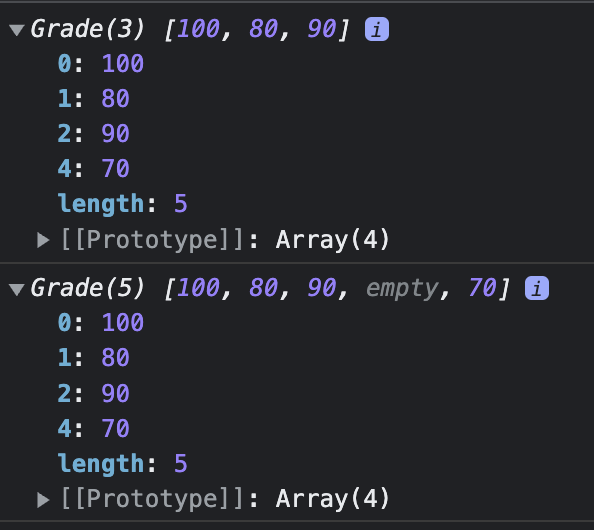
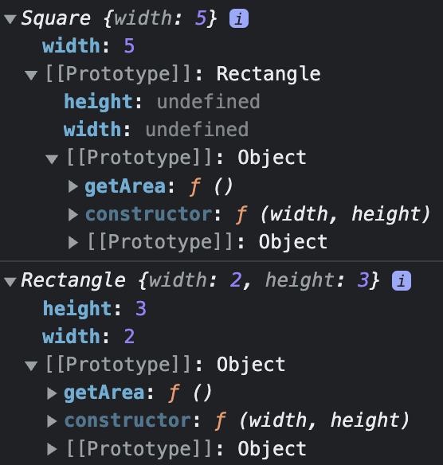

## Javascript Class

- 클래스와 인스턴스 개념 이해
    - 인스턴스란 어떤 클래스의 속성을 지니는 실존하는 개체를 일컬어 인스턴스라고 한다. 사전적으론 ‘사례’라고 번역하는데, 풀어 쓰면 ‘어떤 조건에 부합하는 구체적인 예시'라고 할 수 있다. 여기서 조건을 클래스라고 보면, 어떤 클래스에 속한 개체는 그 클래스의 조건을 모두 만족하므로 그 클래스의 구체적인 예시, 즉 인스턴스라고 할 수 있다.
    - 자바스크립트에서 클래스란?
        - 자바스크립트는 프로토타입 기반의 언어이기 때문에 클래스 개념이 존재하지 않는다. 하지만 프로토타입을 일반적인 의미에서의 클래스 관점에서 접근해보면 비슷하게 해석해볼 수 있는 요소가 있다.
            - new라는 연산자를 사용해 Array와 함께 호출하면 인스턴스가 생성된다. 이때 Array를 일종의 클래스라고 보면, Array.prototype이 ‘상속'된다고 볼 수 있다.
            - 인스턴스에 상속되는 여부에 따라 static member와 prototype member로 구분할 수 있다.
    - 클래스 상속
        
        ```jsx
        let Grade = function(){
          let args = Array.prototype.slice.call(arguments);
          for(let i = 0; i < args.length; i+=1){
            this[i] = args[i];
          }
          this.length = args.length;
        };
        
        Grade.prototype = [];
        
        let g = new Grade(100, 80);
        console.log(g); // [0 : 100, 1 : 80], length : 2
        
        g.push(90);
        console.log(g);
        
        delete g.length;
        g.push(70);
        console.log(g);
        ```
        
        위 코드의 문제점은 length가 삭제가 가능하다는 것과 Grade.prototype에 빈 배열을 참조했다는 것이다.
        
        왜 삭제가 가능한가? Grade 클래스의 인스턴스는 배열 메소드를 상속하지만 **기본적으로는 일반 객체의 성질을 그대로 지니므로 삭제가 가능**해서 문제가 생긴다.
        
        마지막에 length가 1이 될 수 있던 이유는 g.__proto__가 Grade.prototype = []을 참조하고 있기 때문이다.
        
        
        
        책에 적힌대로 결과가 나오지 않는데 이유를 정확하게 모르겠다.
        
        ```jsx
        let Grade = function(){
          let args = Array.prototype.slice.call(arguments);
          for(let i = 0; i < args.length; i+=1){
            this[i] = args[i];
          }
          this.length = args.length;
        };
        
        Grade.prototype = ['a', 'b', 'c', 'd'];
        
        let g = new Grade(100, 80);
        console.log(g); // [0 : 100, 1 : 80], length : 2
        
        g.push(90);
        console.log(g);
        
        delete g.length;
        g.push(70);
        console.log(g);
        ```
        
        
        
        위와 같이 Grade.prototype에 length가 4인 배열을 할당한 경우에 delete g.length를 하였다. 이후에 g에 length가 존재하지 않기 때문에 g.__proto__에 있는 length : 4를 참조하게 되고, 이를 통해 3번 인덱스가 비어 있는 결과 배열이 탄생하게 된다.
        
        이처럼 클래스에 있는 값이 인스턴스의 동작에 영향을 줘서는 안된다. 영향을 줄 수 있다는 것이 클래스의 추상성을 해칠 수 있기 때문이다.
        
        ```jsx
        let Rectangle = function (width, height){
          this.width = width;
          this.height = height;
        }
        
        Rectangle.prototype.getArea = function(){
          return this.width * this.height;
        }
        
        let Square = function(width){
          this.width = width;
        }
        
        Square.prototype.getArea = function (width){
          Rectangle.call(this, width, width);
        }
        
        Square.prototype = new Rectangle();
        
        let sq = new Square(5);
        console.log(sq);
        
        console.log(new sq.constructor(2,3));
        ```
        
        
        
        - 하위 클래스로 삼을 생성자 함수의 prototype에 상위 클래스의 인스턴스를 부여하는 방법으로 간단하게 상속을 구현할 수 있지만 다양한 문제를 발생 시킬 수 있어 구조적 안정성이 떨어진다.
    - 클래스가 구체적인 데이터에 지나지 않게 하는 방법
        - 프로퍼티를 일일이 지우고 더 이상 새로운 프로퍼티를 추가할 수 없게 하는 것이다.
        - 아무런 프로퍼티가 없는 빈 생성자 함수(Bridge)를 만들어 Bridge.prototype이 상위 클래스의 prototype을 참조하게 하고, 하위 클래스의 prototype의 Bridge의 인스턴스를 할당하는 것이다.
            
            ```jsx
            let Rectangle = function (width, height){
              this.width = width;
              this.height = height;
            }
            
            Rectangle.prototype.getArea = function(){
              return this.width * this.height;
            }
            
            let Square = function (width){
              Rectangle.call(this, width, width);
            }
            
            let Bridge = function (){};
            
            Bridge.prototype = Rectangle.prototype;
            Square.prototype = new Bridge();
            Object.freeze(Square.prototype);
            ```
            
        - use Object.create()
            
            ```jsx
            let Rectangle = function (width, height){
              this.width = width;
              this.height = height;
            }
            
            Rectangle.prototype.getArea = function(){
              return this.width * this.height;
            }
            
            let Square = function (width){
              Rectangle.call(this, width, width);
            }
            
            Square.prototype = Object.create(Rectangle.prototype);
            Object.freeze(Square.prototype);
            ```

## Singleton Pattern

전체 시스템에서 클래스에 대한 인스턴스가 하나만 존재하도록 보장하는 ‘객체 생성 패턴'이다. 

- 싱글톤 패턴의 장점
    
    싱글톤 패턴을 사용할 시 장점은 고정된 메모리 영역에 인스턴스 하나만을 사용하기 때문에 **메모리 낭비를 방지**할 수 있다. 또한, 싱글톤으로 만들어진 인스턴스는 전역이기 때문에 **다른 클래스의 인스턴스들이 데이터를 공유하기 쉬워진다.** 
    
- 싱글톤 패턴의 단점
    
    싱글톤 인스턴스가 너무 많은 일을 하거나 많은 데이터를 공유하게 되면, 시스템의 결합도가 높아지기 때문에 주의해야 한다. 높은 결합도를 가진 프로그램은 유지보수가 어려워진다. 
    

### Singleton 구현

단순 전역 변수에 객체 리터럴로 생성하는 작업도 싱글톤이라고 할 수 있다. 하지만, 전역 변수를 사용하기 보다는 클래스 자신이 자기의 유일한 인스턴스로 접근하는 방법을 자체적으로 관리하게 하는 것이 더 좋은 방법이다. 

이러한 방법은 클래스 외부에서는 인스턴스를 생성하지 못하게 하고, 내부에는 단 하나의 인스턴스를 생성해 외부에서 그 인스턴스에 접근할 수 있는 방법을 제공할 수 있다.

싱글톤 구현에 필요한 요소

- 외부 클래스로부터 인스턴스 생성을 차단한다.
- 인스턴스에 직접 접근하는 것을 차단한다.
- 인스턴스에 대한 접점을 제공한다.

```jsx
class Car{
  #name;
  #companyName;
  #breakOil = 'bullsOneShot';
  #totalFuel = 80;
  #fuelEfficiency = 15;

  constructor(name, companyName){
    this.#name = name;
    this.#companyName = companyName;
  }

  static draggedByRekCar(instance){
    return `${instance.#companyName} car is dragged by RekCar. ${instance.#name} so sad`;
  }

  #changeBreakOil(breakOilName){
    this.#breakOil = breakOilName;
  }

  getPosibleTotalDistanceTravel() {
    return this.#totalFuel * this.#fuelEfficiency;
  }

  getName = () =>{
    return this.#name;
  }

  getCompanyName = () =>{
    return this.#companyName;
  }
}

const car = new Car("현민",'카카오');
const car2 = new Car("해인", '네이버');

class ElectronicCar extends Car {
  #governmentSubsidy = 1000;
  static #instance;

  constructor(name, companyName){
    if(ElectronicCar.#instance){
      return ElectronicCar.#instance;
    } 
    super(name, companyName);
    ElectronicCar.#instance = this; 
  }

  decreaseGovernmentSubsidy = (amount) => {
    this.#governmentSubsidy -= amount;
  }

  increaseGovernmentSubsidy = (amount) => {
    this.#governmentSubsidy += amount;
  }
}

console.log(Car.draggedByRekCar(car));
console.log(Car.draggedByRekCar(car2));

let eCar1 = new ElectronicCar('준범', '아우디');
let eCar2 = new ElectronicCar('해인', '포르쉐');
console.log(eCar1 === eCar2);
console.log(eCar1);
console.log(eCar2);
console.log(eCar1.getName())
console.log(eCar2.getName())
```

[[JS] 싱글톤 패턴 (Singleton Pattern)](https://woong-jae.com/javascript/220319-singleton-pattern)