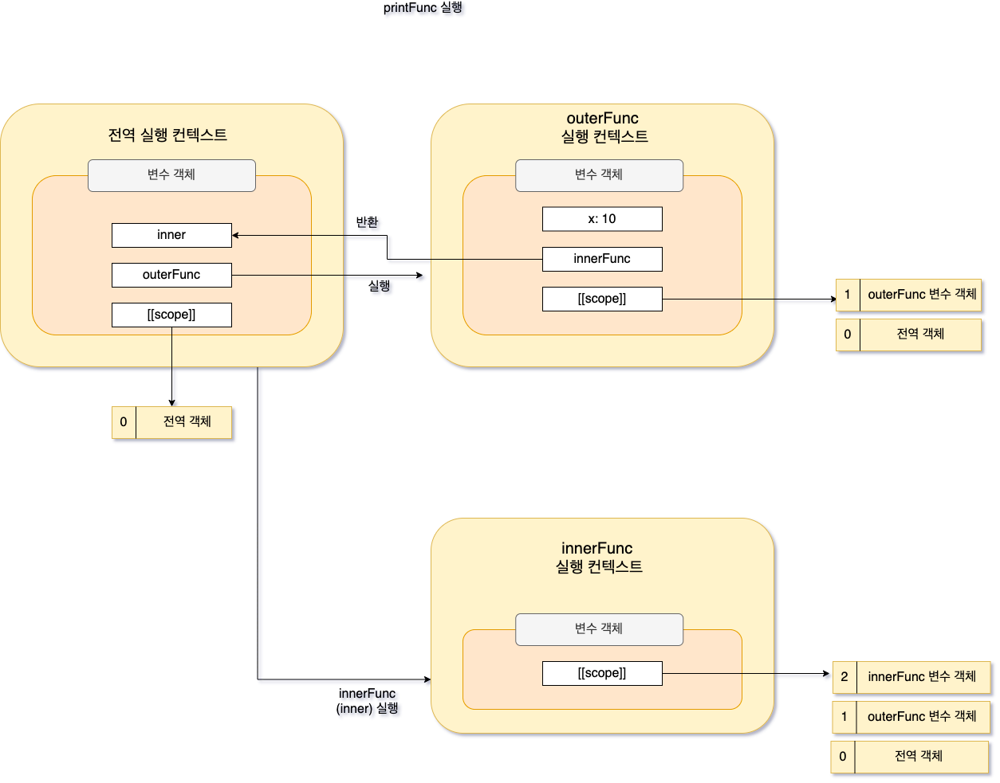
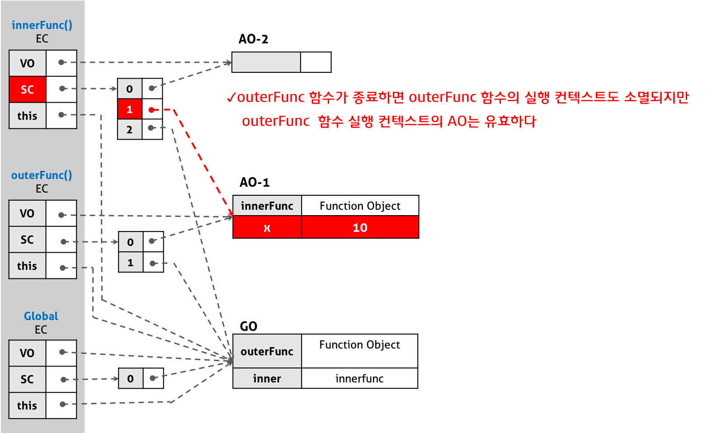

## Closure

- Closure는 ec와 비슷하게 실행될 때의 상황을 기억하지만, 연결이 끊어지는 순간까지 함수 실행이 완료되어 ec 실행이 완료되어도 사라지지 않는 현상 또는 함수를 의미한다.
- 실행 컨텍스트의 생성 과정
    - 활성화 객체 생성
        - 실행 컨텍스트가 생성되면 JS엔진은 **컨텍스트에서 실행에 필요한 여러가지 정보를 담은 객체를 생성**하는데 이를 활성 객체라고 한다.
        - 이 객체에는 **앞으로 사용하게 될 매개 변수, 사용자가 정의한 변수 및 객체를 저장**하고 새로 만들어진 컨텍스트로 접근 가능하게 되어 있다. but 사용자가 접근할 수 있는 것이 아닌, 엔진 내부에서 접근 가능한 것이다.
    - argument 객체 생성
        - argument 객체란 함수에 전달된 인수에 해당하는 Array 형태의 객체를 의미한다.
    - 스코프 정보 생성
        - 컨텍스트의 유효 범위를 나타내는 스코프 정보를 생성한다. 이 스코프 정보를 통해 상위 스코프의 변수에 접근이 가능하다.
    - 변수 생성
        - 실행 컨텍스트 내부에서 사용되는 지역 변수의 생성이 활성 객체 내부에 이루어진다. 변수 객체라고도 부른다.
    - this 바인딩
        - this 키워드를 사용하는 값이 할당된다. this가 참조하는 객체가 없다면 전역 객체를 참조한다.
    - 여기까지 실행 컨텍스트 생성이 완료되고, 코드 실행이 이뤄진다. 이 과정에서 변수 대입 및 연산, 함수 실행 등이 일어난다.

### 그렇다면 클로저란?

```jsx
function outerFunc(){
	var x = 10;
	var innerFunc = function(){
		console.log(x);
	}
	return innerFunc;
}

var inner = outerFunc();
inner():
```





- 실행 컨텍스트적인 관점에서 **내부 함수가 유효한 상태에서 외부 함수가 종료하여 실행 컨텍스트가 반환되어도, 외부 함수 실행 컨텍스트 내의 활성 객체는 내부 함수에 의해 참조되는 한 유효**하다.

## Module

기존의 모듈은 다음과 같이 생겼다.

```jsx
function bar(){
	var something = "cool";
	var another = [1,2,3];

	function doSomething(){
		console.log(something)
	}

	function doAnother(){
		console.log(another.join(" ! "));
	}

	return {
		doSomething : doSomething,
		doAnother : doAnother
	};
}

var foo = bar();
bar.doSomething(); // cool
bar.doAnother(); // 1 ! 2 ! 3
```

가장 흔한 모듈 패턴 구현 방법은 모듈 노출이고, 위의 코드는 이것의 변형이다.

- 모듈 노출
    
    즉시 실행 함수를 통해 private, public 같은 접근 제어자를 만드는 패턴을 말한다. 명시적으로 노출하고 싶은 부분만 정해서 노출하는 방식을 말한다. 
    
    ```jsx
    var myModule = (function(window, undefined) {
      function myMethod() {
        console.log('myMethod');
      }
    
      function myOtherMethod() {
        console.log('myOtherMethod');
      }
    
      return {
        someMethod: myMethod,
        someOtherMethod: myOtherMethod
      };
    })(window);
    
    myModule.myMethod(); // Uncaught TypeError: myModule.myMethod is not a function
    myModule.myOtherMethod(); // Uncaught TypeError: myModule.myOtherMethod is not a function
    myModule.someMethod(); // console.log('myMethod');
    myModule.someOtherMethod(); // console.log('myOtherMethod');
    ```
    
- 현재의 모듈
    
    ES6에서 모듈 개념을 지원하기 시작했는데, 파일을 개별 모듈로 처리한다. 각 모듈은 다른 모듈 또는 특정 API 멤버를 불러오거나 자신의 공개 API 멤버를 내보낼 수 있다. 
    

[면접을 위한 CS 전공지식 노트: 1.1.7 노출모듈 패턴](https://thebook.io/080326/ch01/01/07/)

[노출식 모듈 패턴 Revealing Module Pattern](https://edykim.com/ko/post/revealing-module-pattern/)

[실행 컨텍스트와 클로저 개념 정리](https://webcoding-start.tistory.com/67)

[Closure | PoiemaWeb](https://poiemaweb.com/js-closure)

[클로저 - JavaScript | MDN](https://developer.mozilla.org/ko/docs/Web/JavaScript/Closures#%EC%96%B4%ED%9C%98%EC%A0%81_%EB%B2%94%EC%9C%84_%EC%A7%80%EC%A0%95lexical_scoping)