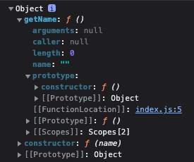

## Prototype

```jsx
let instance = new Constructor();
```

사진 왼쪽 꼭짓점(책)에 Constructor를, 오른쪽 꼭짓점에 Constructor.prototype이라는 프로퍼티를 위치시켰다. 왼쪽 꼭짓점 아래를 향한 화살표에는 new가 있고, 종점에는 instance가 있다. 

> 어떤 생성자 함수(Constructor)를 new 연산자와 함께 호출하면 
Constructor에 정의된 내용을 바탕으로 새로운 인스턴스(instance)가 생성된다.
이때 instance에는 __proto__ 라는 프로퍼티가 자동으로 부여되는데,
이 프로퍼티는 Constructor의 prototype이라는 프로퍼티를 참조한다.
> 

```jsx
let Person = function(name){
	this._name = name;
}

Person.prototype.getName = function(){
	return this._name;
}
```

위와 같은 경우, __proto__ 프로퍼티를 통해서 getName을 호출할 수 있다.

```jsx
suzi.__proto__.getName(); // undefined --- 1
suzi.__proto__ === Person.prototype // true
```

하지만 1번 식을 통해 this 바인딩 대상이 잘못 되었다는 것을 파악할 수 있다. 

어떤 함수를 ‘메서드'로서 호출하는 경우, 메서드명 바로 앞의 객체가 곧 this가 된다. 그렇기 때문에 `getName` 함수의 this값은 suzi.__proto__이고, 이는 Person.prototype를 참조하게되는데 모두 name이라는 프로퍼티를 가지고 있지 않아 undefined를 반환한다.



suzi.__proto__는 _name을 가지고 있지 않다.

정상적으로 this를 바인딩하는 방법은 `suzi.메서드` 방식으로 사용하는 것인데, __proto__는 생략 가능한 프로퍼티이기 때문에 정상적으로 사용이 가능하다. 

### 메소드 vs 함수

함수는 메소드를 포괄하는 의미를 가진다. 

차이점은 다음과 같다.

- 자바스크립트에서 함수가 객체의 프로퍼티로 저장이 된다면 메소드이다.
→ 메소드는 객체로부터 독립적이지 않다.
- 함수가 객체의 프로퍼티가 아니라면 함수이다.

### 정적 메소드, 정적 프로퍼티

정적 메소드, 정적 프로퍼티는 어떤 특정한 객체가 아닌 클래스에 속하는 함수, 프로퍼티를 구현할 때 주로 사용된다.

- prototype 내부에 할당되지 않고, Array 생성자 함수 객체에 직접 할당되어 있는 property
    
    → 이를 static method, static properties라고 부른다. 
    
- 이들을 호출할 땐, new 키워드 없이 함수로써 호출 시에만 의미를 가진다.
- 해당 Class의 소속인 instance들의 개별 동작이 아닌, 소속 여부의 확인, 소속 부여 등의 공동체적 판단을 필요로하는 경우에 `static 메서드`를 활용한다.

**instance에선 정적 메소드에 접근이 불가능하다.**

```jsx
[1,2].isArray(); // TypeError : [1,2].isArray() is not a function
Array.isArray([1,2]); // true 
```

[JavaScript 문법 - static 메소드 및 static 프로퍼티](https://velog.io/@onejaejae/JavaScript-%EB%AC%B8%EB%B2%95-static-%EB%A9%94%EC%86%8C%EB%93%9C-%EB%B0%8F-static-%ED%94%84%EB%A1%9C%ED%8D%BC%ED%8B%B0)

[정적 메서드와 정적 프로퍼티](https://velog.io/@gusdnr814/%EC%A0%95%EC%A0%81-%EB%A9%94%EC%84%9C%EB%93%9C%EC%99%80-%EC%A0%95%EC%A0%81-%ED%94%84%EB%A1%9C%ED%8D%BC%ED%8B%B0)

[정적 메서드와 정적 프로퍼티](https://ko.javascript.info/static-properties-methods)

## Constructor Property

prototype 객체 내부에는 constructor라는 프로퍼티가 존재한다. 인스턴스의 __proto__ 객체 내부에도 마찬가지로 존재하는데, 원래의 생성자 함수(자기자신)을 참조한다. 자신을 참조하는 프로퍼티를 가지고 있는 이유는 인스턴스와의 관계 때문이다. 인스턴스로부터 그 원형이 무엇인지를 알 수 있는 수단이기 때문이다.

```jsx
function Person (name){
  this.name = name;
}

let hello = new Person('wow');

console.log(Person.prototype.constructor === Person); // true
console.log(hello.__proto__.constructor === Person); // true
console.log(hello.constructor === Person); // true
```

기존에 존재하는 객체의 constructor를 사용해 새로운 객체를 만들 수도 있다. 

```jsx
let newHello = new hello.constructor('hello');

console.log(newHello); // Person{name : 'hello'}
```

위와 같은 경우는 객체가 이미 존재하는데 어떤 생성자를 사용하여 객체를 생성했는지 알 수 없는 경우에 유용하게 사용이 가능하다. ex) 서드 파티 라이브러리에서 온 객체의 경우..

constructor 변경도 가능한데, 읽기 전용 속성이 부여된 예외적인 경우(기본형 리터럴 변수 - number, string, boolean)를 제외하고 값을 변경할 수 있다. 하지만 **constructor를 변경한다고 기존의 인스턴스 원형이 바뀌거나 데이터 타입이 변하지는 않는다.** 

## Prototype Chain

### 메소드 오버라이드

```jsx
function Person (name){
  this.name = name;
}

Person.prototype.getName = function (){
  return this.name;
}

let hello = new Person('wow');

hello.getName = function (){
  return `very ${this.name}`;
}

console.log(hello.getName()); // very wow
```

인스턴스가 동일한 이름의 프로퍼티 또는 메서드를 가지고 있는 상황의 경우 원본인 prototype에 있는 getName 메소드 위에 hello 인스턴스의 getName을 덮어씌운다. 이후 hello에 할당된 getName을 실행한다.

위와 같은 결과 나타나는 이유는 자바스크립트 엔진이 getName 메소드를 찾는 방식이 가장 가까운 곳에서부터 프로퍼티를 검색하고 없다면 상위로 이동해 찾는 방식을 가지고 있기 때문이다.(Prototype chaining)

상위 메소드를 인스턴스에서 사용하는 방법은 아래와 같다.

```jsx
console.log(Person.prototype.getName.call(hello)); // wow
```

## Object.prototype

어떤 생성자 함수이든 prototype은 반드시 객체이기 때문에 Object.prototype이 언제나 프로토타입의 최상단에 존재하게 된다. 따라서 객체에서만 사용할 메서드는 다른 여느 데이터 타입처럼 prototype 객체 안에 정의할 수가 없다. 왜냐하면 객체에서만 사용할 메서드를 Object.prototype 내부에 정의하게 되면, 다른 데이터 타입도 해당 메소드를 사용할 수 있게 되기 때문이다.

```jsx
Object.prototype.getEntries = function(){
  let res = [];
  console.log(this);
  for (let prop in this){
    console.log(prop);
    if(this.hasOwnProperty(prop)){
      res.push([prop, this[prop]]);
    }
  }
  return res;
}

let data = [
  ['object', {a : 1, b : 2, c: 3}],
  ['number', 345],
  ['string', 'abc'],
  ['boolean', false],
  ['func', function(){}],
  ['array', [1,2,3]]
];

data.forEach(function(datum){
  console.log(datum[1].getEntries());
});
```

위에 코드에서 원래 의도대로라면 Object가 아닌 데이터 타입에선 오류를 던져야하는데 오류를 던지지 않는다. 모든 자료형이 프로토타입 체이닝을 통해 getEntries 메소드에 접근할 수 있기 때문이다. **그렇기 때문에 static 메소드를 부여할 필요가 있다.** 

위와 같은 이유로 Object.prototype에는 어떤 데이터에서도 활용할 수 있는 범용적인 메서드들만이 있다. `toString, hasOwnProperty, valueOf, isPrototypeOf` 등이 들어있다. 

→ 예외적인 경우로 Object.create(null)로 생성할 시, Object.prototype에 접근할 수 없다. 이는 __proto__가 없는 객체를 생성한다. 

### instance.__proto__와 Object.prototype 연결 방법

생성자 함수의 prototype이 연결하고자하는 상위 생성자 함수의 인스턴스를 바라보게 해주면 된다. 

```jsx
let Grade = function(){
	let args = Array.prototype.slice.call(arguments);
	for(let i = 0; i < args.length; i+=1){
		this[i] = args[i];
	}
	this.length = args.length;
};

let g = new Grade(100,80);

Grade.prototype = [];
```

위와 같이 연결하게 되면 Grade의 instance인 g에서 직접 배열의 메소드를 사용할 수 있다. 

[출처] 코어 자바스크립트 - 정재남 저