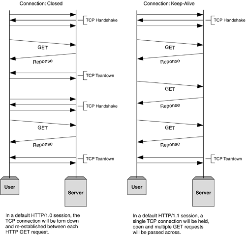
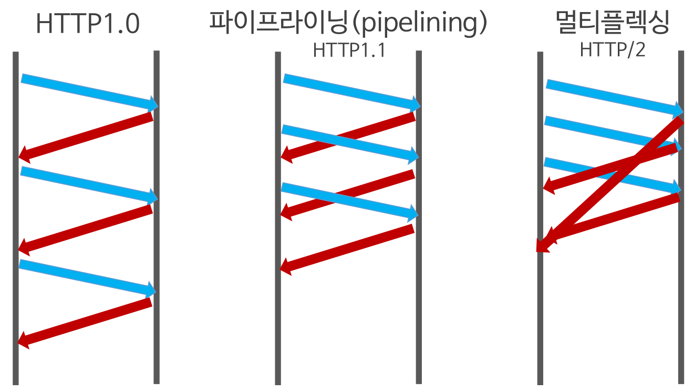
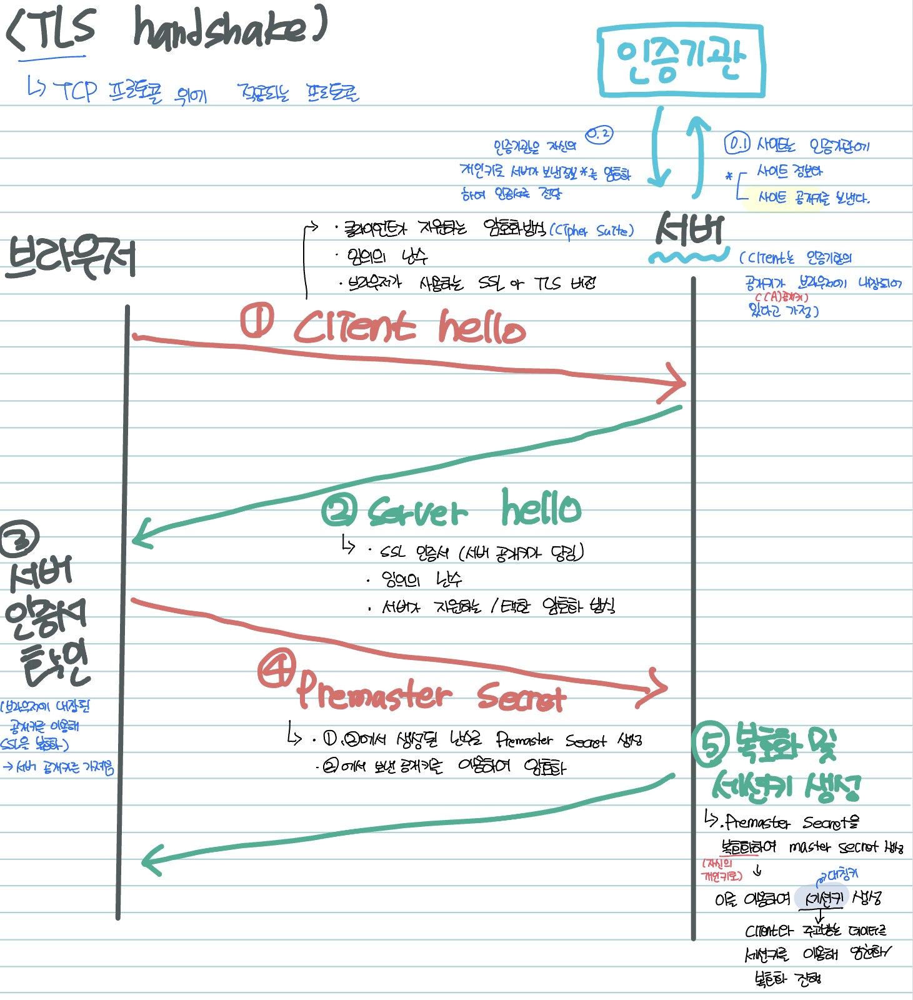

## 1. HTTP 0.9

- 원라인 프로토콜
- 요청은 한줄로만 이루어지며, 사용할 수 있는 메소드는 GET만 존재하였다.
- 응답도 html 파일 내용만 존재했다.(상태, 오류코드 존재 x)

## 2. HTTP 1.0

- 확장성 만들기
- 요청시 버전정보가 기록되었다.
- 응답 시작부분에 상태 코드라인이 붙어 브라우저가 요청에 대한 성공, 실패를 알 수 있었다.
- 요청과 응답에 HTTP 헤더가 붙었다.
- Content-type 헤더 도입으로 HTML 이외의 문서 전송이 가능해 졌다.

  [한계]

    - 커넥션 하나 당 요청 1개와 응답 1개만 가능했다.

## 3. HTTP 1.1

- 파이프 라이닝을 추가

  : 앞 요청의 응답을 기다리지 않고 `순차적인 여러 요청`을 `연속적`으로 보내고 그 순서에 맞춰 응답을 받는 방식이 등장

- Persistent Connection추가

  : 지정한 timeout 동안에 커넥션을 닫지 않는다. → 커넥션 사용성 증가

- 순차적으로 하나씩 요청 / 응답이 처리되는 기존 방식을 개선
- 하나의 커넥션에 여러개의 요청이 들어 있을 뿐, 동시에 여러개의 요청을 처리해 응답으로 보내주는 것은 아니다 (`multiplexing` 되지는 않음)

[한계]

- `Head Of Line Blocking (HOL)`: 결국 앞 요청의 응답이 너무 오래걸리면 뒤 요청은 `Blocking` 되어버림
- `Header 구조의 중복`: 연속된 요청의 헤더의 많은 중복이 발생

## 4. HTTP 2.0

- 기존 HTTP 1.X 버전의 성능 향상에 초점을 맞춘 프로토콜 (2015년 등장)표준의 대체가 아닌 확장 (표준 : HTTP 1.1)
- 특징
    - 1) HTTP 메시지 전송 방식의 전환
    - 2) `Multiplexed Streams`
    - 3) `Stream Prioritization`
    - 4) `Server Push`
    - 5) `Header Compression`

---

### HTTP 메시지 전송 방식의 전환

- 기존 : 일반 텍스트 형식
- 개선
    - `Binary Framing` 계층을 추가해서 보내는 메시지를 프레임(`frame`)이라는 단위로 분할하며 추가적으로 `바이너리`로 `인코딩`을 한다(바이너리 형식 사용으로 `파싱속도` 및 `전송 속도`가 빠르고 `오류 발생 가능성`이 낮아짐)

---

### Multiplexed Streams

- 기존 : HTTP 1.1의 Pipelining 으로 하나의 커넥션에 여러 요청이 있지만, 결국 동시에 여러 요청을 처리해 응답으로 주지는 못하였음
- 개선
    - 구성된 연결 내에 전달되는 `바이트의 양방향 흐름`을 의미하는 `Stream`으로 요청 / 응답이 교환됨(`하나의 커넥션` 안에 `여러개의 Stream` 존재 가능)
    - 메시지가 이진화된 텍스트인 프레임(`frame`)으로 나뉘어 요청마다 구분되는 `Stream`을 통해 전달
    - 즉, 프레임(`frame`)이 각 요청의 스트림(`stream`)을 통해 전달되며, 하나의 커넥션 안에 여러개의 스트림(`stream`)을 가질 수 있게되어 다중화(`multiplexing`)가 가능해짐> `동시에 여러 요청을 처리`하는 것이 가능해짐> `Stream`을 통해서 `각 요청`의 `응답의 순서가 의미`가 없어져서 `HOL Blocking`이 자연스럽게 해결됨

---

### Stream Prioritization

- 리소스간 우선순위를 설정하는 기능
- Stream에 우선순위를 부여해서 인터리빙되고 전달하는 것이 가능해짐

---

### Server Push

- 단일 클라이언트 요청에 여러 응답을 보낼 수 있는 특징을 통해 Server에서 client에게 필요한 추가적인 리소스를 push해주는 기능

---

### Header Compression

- 기존 : 연속된 요청의 경우 많은 중복된 헤더의 전송으로 오버헤드가 많이발생했음
- 개선
    - 요청과 응답의 헤더 메타데이터를 압축해서 오버헤드를 감소
    - 1) 전송되는 헤더 필드를 `static dynamic table`로 서버에서 유지
    - 2) 이전에 표시된 헤더를 제외한 필드를 허프만(`huffman`) 인코딩을 수행해서 데이터를 압축

---

### [ HTTP 2.0 한계 ]

- 각 요청마다 Stream으로 구분해서 병렬적으로 처리하지만,결국 이에는 TCP 고유의 `HOL Blocking`이 존재
- 왜냐하면, 서로 다른 Stream이 전송되고 있을 때, 하나의 Stream에서 유실이 발생되거나 문제가 생기면 결국 다른 Stream도 문제가 해결될 때 까지 지연되는 현상이 발생되기 때문
- 즉, 이러한 TCP의 태생적인 `HOL Blocking`을 해결하기 위해 `QUIC / HTTP3.0`이 등장

## 5. HTTP 3.0

전송 계층에 TCP/TLS 대신에 QUIC가 이용된다.

- QUIC란

  Quick UDP Internet Connection의 약자로 UDP 상에 구현된 실험적인 다중 전송 프로토콜이가.

  TCP 및 웹 애플리케이션 전송을 개선하기 위한 방법을 위해 Google에서 실험적으로 개발하였다.

  TCP는 많은 운영 체제 커널에 내장되어 있기 때문에 변경사항을 실험하고 수정을 구현하는 것에 시간이 많이드는 과정이기에, QUIC을 만들어 개발자는 더 빠르게 실험을 할 수 있고, 새로운 것을 시도할 수 있게 되었다.

  QUIC은 HTTP/2의 의미론적 지원을 위해 설계되었다. 멀티플랙싱, 흐름 제어, 보안 및 혼잡 제어를 제공해준다.

  QUIC의 중요한 기능이다.

    - 연결 설정 시간 단축
    - 혼잡 제어 개선
    - Head of Line Blocking 없는 멀티플렉싱
    - 전달 오류 수정
    - 연결 마이그레이션

## TLS

### Reference

[HTTP의 진화 - HTTP | MDN](https://developer.mozilla.org/ko/docs/Web/HTTP/Basics_of_HTTP/Evolution_of_HTTP)

[HTTP (1) - version 별 특징 (0.9 / 1.0 / 2.0 / 3.0)](https://velog.io/@neity16/HTTP-HTTP-%EB%B2%84%EC%A0%84-%EB%B3%84-%ED%8A%B9%EC%A7%95)

[HTTP 프로토콜 1.0 vs 1.1 vs 2.0 비교](https://hirlawldo.tistory.com/106)

